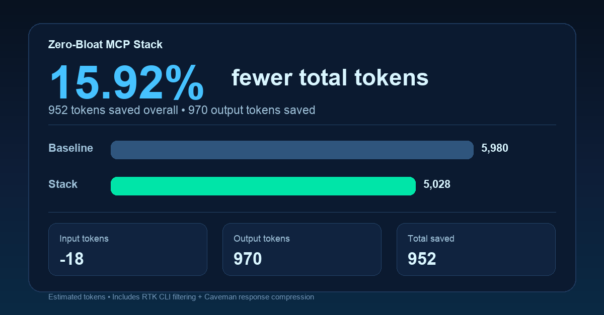

# Zero-Bloat MCP Agent Stack

A highly optimized, token-efficient AI developer environment. 

This repository provides a zero-bloat pipeline for AI coding assistants. By combining Model Context Protocol (MCP) semantic routing, local CLI sandboxing, and progressive prompt disclosure, this stack prevents context rot and reduces input and output token costs. It is designed for token-efficient local development without exhausting system memory.

## Compatibility

This stack is primarily built and tested for UNIX-like environments and modern AI coding assistants.

* **Operating Systems:** macOS (Apple Silicon / M-Series tested) and Linux.
* **AI Assistants:** Fully compatible with Codex (Claude Code CLI). The underlying MCP servers and orchestration patterns can also be ported to Cursor and Google Antigravity with minor configuration tweaks.
* **Prerequisites:** Git, Node.js (npm), Python 3 (pip), and bash/zsh.

## The Stack

This dotfiles configuration automatically installs and links the following open-source tools:

* **[n2-qln](https://www.npmjs.com/package/n2-qln)**: A semantic MCP proxy router that acts as a gatekeeper, dynamically fetching tools only when the AI explicitly needs them.
* **[Context-Mode](https://www.npmjs.com/package/context-mode)**: Intercepts large terminal outputs (like test suites), runs them in an isolated sandbox, and returns compressed summaries to the AI.
* **[Graphifyy](https://pypi.org/project/graphifyy/)**: Builds a structural knowledge graph of your project, preventing the AI from reading raw files to understand architecture.
* **[RTK (Rust Token Killer)](https://github.com/rtk-ai/rtk)**: A background CLI hook that automatically strips formatting and verbosity from terminal logs before the LLM processes them.
* **[Caveman](https://github.com/JuliusBrussee/caveman)**: A system prompt skill that forces the AI to drop conversational filler and output bare-metal code.
* **[Agent Skills](https://github.com/addyosmani/agent-skills)**: Addy Osmani's progressive disclosure engineering prompts for modular, zero-bloat interactions.

## Installation

Clone this repository into a `.dotfiles` directory and run the installer.

```bash
git clone https://github.com/JacobThree/zero-bloat-mcp-stack.git ~/.dotfiles
cd ~/.dotfiles
chmod +x install.sh
./install.sh
```

## Reinstall / Repair

If stack already cloned and you want to reinstall everything:

```bash
cd ~/.dotfiles
chmod +x install.sh
./install.sh
```

If you want full fresh reinstall:

```bash
rm -rf ~/.dotfiles
git clone https://github.com/JacobThree/zero-bloat-mcp-stack.git ~/.dotfiles
cd ~/.dotfiles
chmod +x install.sh
./install.sh
```

What the script does:

- Installs global NPM packages for routing and sandboxing.
- Installs Python MCP servers for codebase mapping.
- Installs and initializes the Rust Token Killer.
- Maps Agent Skills lifecycle commands into global skill aliases (`/spec`, `/plan`, `/build`, `/test`, `/review`, `/ship`).
- Runs global smoke checks for `rtk`, `n2-qln`, `context-mode`, and `graphify`.

## Quickstart (Codex)

To initialize this architecture in a new or existing project, navigate to your project directory and run:

```bash
$caveman Execute ~/.dotfiles/ai_blueprints/project_init.md strictly.
```
This command will:

- Create `CLAUDE.md` with project context and lifecycle command mapping.
- Generate `.codex/config.toml` for `n2-qln`, `context-mode`, and `graphify`.
- Run stack checks and write `.codex/stack-check.md`.

## Existing Project Workflow (Recommended Order)

Run this sequence in any existing repo:

```bash
# 1) Enter project
cd /path/to/your/project

# 2) Initialize project wiring (CLAUDE.md + .codex/config.toml + stack check)
$caveman Execute ~/.dotfiles/ai_blueprints/project_init.md strictly.

# 3) Verify project stack health
~/.dotfiles/ai_blueprints/stack_smoke_test.sh
cat .codex/stack-check.md

# 4) Build graph index for architecture-aware queries
graphify update .
ls -la graphify-out

# 5) Start working with lifecycle commands in Codex
# /spec -> /plan -> /build -> /test -> /review -> /ship
```

Practical daily loop:

```text
/plan
/build
/test
/review
```

When codebase changes heavily, refresh graph:

```bash
graphify update .
```

## Verify Stack

Run per-project smoke test:

```bash
~/.dotfiles/ai_blueprints/stack_smoke_test.sh
```

Read results:

```bash
cat .codex/stack-check.md
```

Global checks:

```bash
rtk --version
n2-qln --help
context-mode --help
python -m graphify --help
```

## Token Savings Snapshot

Latest full-stack benchmark (RTK + Caveman) shows 15.92% fewer total tokens in this repository.



## Command Reference

Install stack:

```bash
cd ~/.dotfiles && ./install.sh
```

Initialize current repo:

```bash
$caveman Execute ~/.dotfiles/ai_blueprints/project_init.md strictly.
```

Skill lifecycle commands (inside Codex):

```text
/spec
/plan
/build
/test
/review
/code-simplify
/ship
```

Graphify map + report:

```bash
graphify update .
ls -la graphify-out
```

RTK stats:

```bash
rtk gain
```

License

This project is licensed under the MIT License. See the LICENSE file for details.
